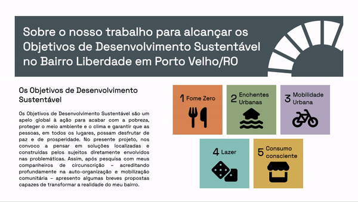
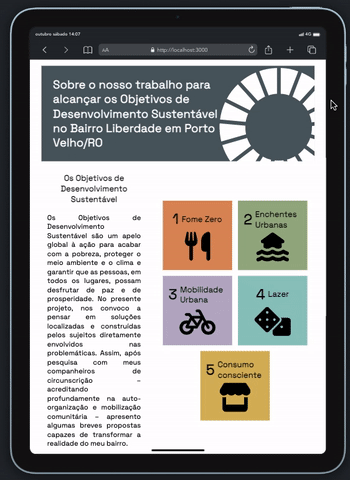
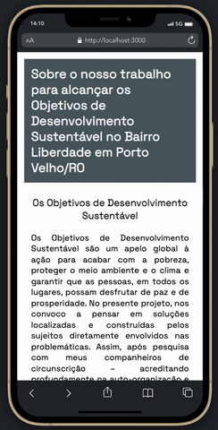

## Objetivos de Desenvolvimento Sustentável no Bairro Liberdade em Porto Velho/RO

<i>Projeto desenvolvido como desafio referente ao módulo 2 do curso Vai na Web de desenvolvimento front-end. </i>  

    
    
    
    

 

Os Objetivos de Desenvolvimento Sustentável (ODS) são uma agenda mundial adotada durante a Cúpula das Nações Unidas sobre o Desenvolvimento Sustentável em setembro de 2015 composta por 17 objetivos e 169 metas a serem atingidos até 2030.

No projeto em questão, nos propomos a pensar em soluções possíveis a partir dos problemas enfrentados nos bairros em que moramos. Assim, após pesquisa e levantamento de informações, apresento algumas propostas como Objetivos de Desenvolvimento Sustentável para o Bairro Liberdade, em Porto Velho/RO.

## PREVIEW

  
  
  

 

    

